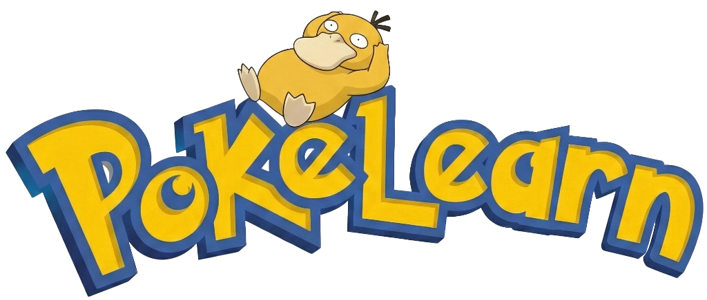

# PokéLearn <span style="color:red;">◓</span>




> [!IMPORTANT]
> **Disclaimer**: This is a non-profit educational project created solely for personal learning and demonstration purposes. **Pokémon** and **Pokémon character names** are trademarks of **Nintendo**, **Game Freak**, and **The Pokémon Company**. No copyright infringement is intended. All assets are used under fair use for educational context.

**PokéLearn** is an interactive educational game that combines the nostalgia of classic monster-catching adventures with learning mechanics. Battle, capture, and evolve your team by answering questions! The project is partnered with Google Gemini.

## Features 

◓ **Battle to Learn**: Defeat wild Pokemon by answering English, Math, and General Knowledge questions correctly.

◓ **Catch 'Em All**: Build your collection! Use your knowledge to weaken and capture 50+ unique species.

◓ **Evolution System**: Watch your partners grow! Earn XP per correct answer and evolve them into powerful forms.

◓ **Real-time Pokedex**: distinct "Caught" and "Seen" tracking with detailed data entries.

◓ **Inventory Bag**: Manage your active team and view your progress.

## How to Play

1.  **Start Your Journey**: Choose a starter Pokemon.
2.  **Encounter Questions**: Wild Pokemon appear! Answer questions to attack.
3.  **Capture**: Win battles to catch new Pokemon (10 correct answers for Normal, 20 for Strong).
4.  **Evolve**: Gain 10 XP (10 answers) to reach Stage 2, and 30 XP total for Stage 3.

### Local Development

```bash
npm install
npm run dev
```

Enjoy learning!
